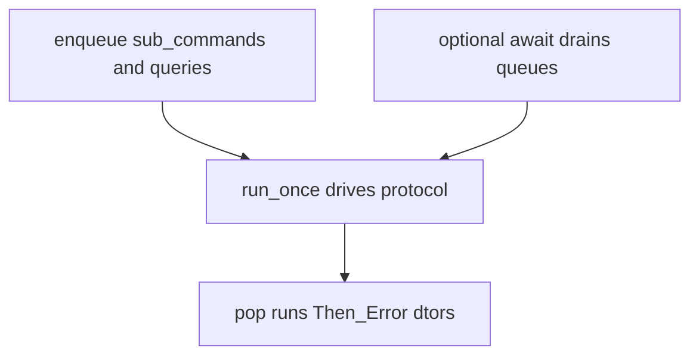

# `qbm-pgsql` — Technical documentation index

This directory is the **long-form** companion to the [root README](../README.md). It tracks the **current**
implementation: **C++23**, **callback** (ordered async) and **coroutine** APIs on **`qb::io::async`**, **`Reply<T>`**,
**`run_sync`** (via **`pgsql/pgsql.h`**), **`with_transaction`**, **LISTEN/NOTIFY**, and **`set_timeout()`** + **`BEGIN`
**.

---

## How to read this module

### 1. One header for application code

```cpp
#include <pgsql/pgsql.h>
```

You get **`qb::pg::tcp::database`**, **`Reply`**, **`transaction_abort`**, **`with_transaction`**, **`task`**, *
*`run_sync`**, discards, OID aliases, and (through **`qb::io::async`**) **`init`**, **`run`**, **`run_once`**. For *
*standalone** programs, call **`qb::io::async::init()`** before the first DB operation.

### 2. Two orthogonal completion models

| Model          | When to use                                      | How work finishes                                                                                                                                     |
|:---------------|:-------------------------------------------------|:------------------------------------------------------------------------------------------------------------------------------------------------------|
| **Callbacks**  | Fluent chains, actor-friendly enqueue-only style | **`run_once`** / **`run`** drains **`_queries`**; **`Transaction::await()`** is **optional** (tests, init, or when you need a **`status`** snapshot). |
| **Coroutines** | **`with_transaction`**, linear control flow      | **`co_await`** → **`Reply<T>`**; sync bridge **`run_sync`**.                                                                                        |

**Ordered async:** Callback overloads push **`ISqlQuery`** and sub-commands onto queues ([
`transaction.cpp`](../src/transaction.cpp)). They return **`Transaction&`** immediately. **`then` / `success` / `error`
** enqueue **`Then` / `Error`** wrappers ([`transaction.inl`](../src/transaction.inl)); when those objects are **popped
**, their destructors run the next success or error lambda ([`commands.h`](../src/commands.h) — see **`Then::~Then`**, *
*`Error::~Error`**).

**Never mix** undriven coroutine awaiters inside **`begin(...)`** callback bodies — see **`pgsql.h`** “Large-project
conventions”.

### 3. Mental model

One **`database`** instance owns **one TCP (or TLS) session**, **one protocol state machine**, and **one
prepared-statement LRU**. **`execute` / `prepare` / `begin`** enqueue work; the thread that drives **`qb::io::async`**
executes wire I/O and invokes callbacks or resumes coroutines.

---

## Guide files

| File                                         | Topics                                                                                                                                                                                                     |
|:---------------------------------------------|:-----------------------------------------------------------------------------------------------------------------------------------------------------------------------------------------------------------|
| **[connection.md](./connection.md)**         | DSN, **`connection_options`**, **`connect_awaiter`** only (no callback connect), handshake, **`disconnect`/`prepare_reconnect`**, SSL, auth                                                                |
| **[transaction.md](./transaction.md)**       | **`Begin`/`End`**, ordered async, **`then`/`error`** (inner vs root chain), optional **`await()`**, **`status`**, coroutine **`commit`/`rollback`**, **`with_transaction`**, **`set_timeout`**, savepoints |
| **[queries.md](./queries.md)**               | Every op: coroutine + callback, **`execute` SFINAE**, prepared/file/NOTIFY/LISTEN, discards                                                                                                                |
| **[results.md](./results.md)**               | **`results`**, **`result_impl`**, **`row`/`field`**, **`Reply<resultset>`**, JSON                                                                                                                        |
| **[types.md](./types.md)**                   | OIDs, **`type_oid_prefers_binary_result_format`**, **`ParamSerializer`/`FieldHandler`**, **`params`**, NULL                                                                                                |
| **[error_handling.md](./error_handling.md)** | **`Reply`**, **`Error` command**, **`status`**, SQLSTATE, **`client_error`**                                                                                                                             |
| **[testing.md](./testing.md)**               | **`QB_PG_*`**, CTest, test map; **`.then`/`.error`** coverage gap                                                                                                                                          |

---

## Source map (contributors)

| Concern                                                  | Location                                                                                                                  |
|:---------------------------------------------------------|:--------------------------------------------------------------------------------------------------------------------------|
| Public API surface, routing, auth, COPY/notify handlers  | **`qbm/pgsql/pgsql.h`**                                                                                                   |
| Command queue, **`await()`**, coroutine overloads        | **`src/transaction.h`**, **`transaction.cpp`**, **`transaction.inl`**, **`transaction_coro.inl`**                         |
| **`Begin`/`End`/`SavePoint`/`Then`/`Error`**             | **`src/commands.h`**                                                                                                      |
| **`BeginQuery`/`CommitQuery`/…** wire bytes              | **`src/queries.h`**                                                                                                       |
| **`with_transaction`**                                   | **`src/coro_with_transaction.hpp`**                                                                                       |
| **`pg_awaiter`**, **`Reply`**, **`transaction_abort`** | **`src/pg_awaiter.h`**, **`src/pg_reply.h`**                                                                              |
| Framed messages                                          | **`src/protocol.h`**, **`src/protocol.cpp`**, **`qb::protocol::pgsql`** in **`pgsql.h`**                                  |
| Types / bind / unbind                                    | **`type_mapping.h`**, **`type_converter.h`**, **`param_serializer.h`**, **`param_unserializer.h`**, **`field_handler.h`** |
| Errors / SQLSTATE                                        | **`src/error.h`**, **`src/sqlstates.h`**                                                                                  |
| NOTIFY SQL safety                                        | **`src/pg_notify_sql.h`**                                                                                               |

---

## Optional: queue / drain flow



---

## Examples as specification

Integration tests under **`qbm/pgsql/tests/`** are **executable documentation**. When in doubt, grep the test name or
read:

- **`test-pgsql-coro-api.cpp`** — coroutines, **`with_transaction`**, savepoints, **`run_sync`**
- **`test-transaction.cpp`** — callback **`begin`**, nested **`savepoint`**, **`await()`**
- **`test-notify.cpp`** — LISTEN/NOTIFY, **`notify_co_consumer`**, **`io_pump`** ordering
- **`test-transaction-advanced.cpp`** — timeouts, constraints, cursors, **`set_timeout`**
- **`test-prepared-statements.cpp`** — LRU, eviction, large results
- **`test-protocol-integration.cpp`** — COPY edge, binary columns, integration

**Note:** Fluent **`.then` / `.error` on the root `database`** after **`begin`** are **rarely exercised** in tests;
behaviour is defined in **`src/commands.h`**. See [testing.md](./testing.md).
