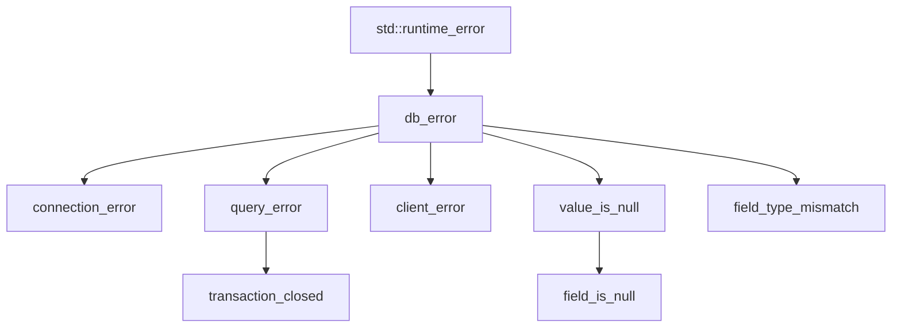

# Error handling

> **Audience:** Adopter · **Status:** stable · **Verified-against:** qbm-pgsql @ qb 3.0.0 (C++20 default, C++23
> supported)

How `qbm-pgsql` reports failures: the `qb::pg::error::db_error` hierarchy, SQLSTATE codes, the coroutine error-result
model (`Reply<T>`) versus the C++ exceptions used at the field-decode and `with_transaction` seams, and the two
protocol-level containment mechanisms (the `noexcept` `onMessage` boundary and the malformed-frame drop via `not_ok()`)
that keep a hostile or misconfigured server from crashing your actor.

**Prerequisites:** [connection.md](./connection.md) (you need a connected `database`), [queries.md](./queries.md) (how
operations run) — **See also:** [transaction.md](./transaction.md), [results.md](./results.md), [types.md](./types.md)

**Include:** `#include <pgsql/pgsql.h>` — the error surface lives in namespace `qb::pg` and `qb::pg::error`.

`qbm-pgsql` is a compiled library (`qbm::pgsql`) — static by default, shared when `BUILD_SHARED_LIBS`/
`QB_BUILD_SHARED_LIBS` is on; link it with `target_link_libraries(app PRIVATE qbm::pgsql)`. It is not header-only.

---

## Summary

`qbm-pgsql` reports failures through three distinct channels, and choosing the right one for each call site is the whole
skill:

- **Error results (`Reply<T>`)** are the default for the coroutine API. `co_await db.execute(...)` yields a
  `qb::pg::Reply<T>`; you test `r.ok()` (or `if (r)`) and read `r.error()` on failure. No exception is thrown. This is
  the path for ordinary SQL and protocol errors.
- **Error callbacks (`on_error`)** are the default for the fluent (callback) API.
  `db.execute(sql, on_success, on_error)` invokes your `on_error` with a `qb::pg::error::db_error const&` when that
  command fails.
- **C++ exceptions** are used only at two seams: result extraction (`field.as<T>()` on a NULL or type-mismatched field
  throws `value_is_null` / `field_type_mismatch`), and the `with_transaction` scope, where you
  `throw qb::pg::transaction_abort{...}` to force a `ROLLBACK` and any other exception propagates after the rollback.

Underneath all three sits the protocol layer, which never lets a server-induced failure escape as an uncaught exception
or a synchronous transport teardown. A malformed frame or a throwing message handler is contained, the connection is
dropped cleanly, and every pending operation resumes with a failure instead of hanging or terminating the process.

A `qb::pg::error::db_error` carries the PostgreSQL severity, the raw `code` string, the `detail` text, and a decoded
`sqlstate::code` enumerator. You branch on the enumerator, not on five-character strings.

The three channels at a glance:

| Channel | Used by | Fires on | How you read it | Throws? |
|---|---|---|---|---|
| `Reply<T>` result | coroutine API (`co_await db.execute(...)`) | SQL + protocol errors | `r.ok()` / `if (r)`, then `r.error()` | no |
| `on_error` callback | fluent API (`db.execute(sql, on_ok, on_err)`) | SQL + protocol errors | `db_error const&` argument | no |
| C++ exception | `field.as<T>()` decode + `with_transaction` body | NULL / type-mismatch decode; `throw transaction_abort{...}` | `try`/`catch` (or `std::optional<T>` to avoid) | yes |

---

## Concepts

### The `db_error` hierarchy

<!-- src: qbm/pgsql/src/error.h -->

All errors derive from `qb::pg::error::db_error`, which extends `std::runtime_error` with four PostgreSQL-specific
fields:

```cpp
namespace qb::pg::error {
class db_error : public std::runtime_error {
public:
    std::string    severity; // "ERROR", "FATAL", "PANIC", "WARNING", ...
    std::string    code;     // raw five-character PostgreSQL code string, e.g. "42P01"
    std::string    detail;   // additional server-supplied context
    sqlstate::code sqlstate; // decoded enumerator, e.g. sqlstate::undefined_table
};
}
```

The subclasses narrow the cause (base at the top; arrows point to derived types):



| Type                             | Role                                                                                                                                       |
|:---------------------------------|:-------------------------------------------------------------------------------------------------------------------------------------------|
| `db_error`                       | Base. Carries `what()`, `severity`, `code`, `detail`, `sqlstate`.                                                                          |
| `connection_error`               | Connect, transport, handshake, or shutdown failure.                                                                                        |
| `query_error`                    | A server-reported SQL or protocol error during a command (the `ErrorResponse` path). Carries the full severity / code / detail / SQLSTATE. |
| `transaction_closed`             | A `query_error` subclass thrown when you operate on a finished transaction.                                                                |
| `client_error`                   | A user-supplied callback threw, or the connection dropped. Wraps the original message.                                                     |
| `value_is_null`, `field_is_null` | Result extraction hit a NULL field with a non-`std::optional` target. Not a server error.                                                  |
| `field_type_mismatch`            | Result extraction could not convert a field to the requested C++ type. Not a server error.                                                 |

`field_is_null` derives from `value_is_null`, which derives from `db_error`; both are field-decode failures, not wire
failures. See [results.md](./results.md) for how `as<T>()` raises them and how `std::optional<T>` avoids `value_is_null`
entirely.

When you receive a `db_error` (in a callback, on a `Reply`, or as a caught exception), the four fields are fully
populated for the `query_error` path. On the `connection_error` path only `what()` is meaningful and `sqlstate` stays
`sqlstate::unknown_code`. A `client_error` is different: it carries a fixed `severity` of `"ERROR"`, `code` `"00000"`,
`detail` `"client error"`, and a `sqlstate` of `sqlstate::successful_completion` (the decode of `"00000"`) — so do
**not** test `sqlstate == sqlstate::unknown_code` to detect a `client_error`.

### SQLSTATE codes

<!-- src: qbm/pgsql/src/sqlstates.h -->

`qb::pg::sqlstate` is a namespace containing an unscoped `enum code` with one enumerator per PostgreSQL SQLSTATE in
the [errcodes appendix](https://www.postgresql.org/docs/current/errcodes-appendix.html), plus a leading `unknown_code`
sentinel for "no SQLSTATE decoded". The driver decodes the server's `C` field into this enumerator and stores it on
`db_error::sqlstate`, so you branch on a typed value:

```cpp
if (err.sqlstate == qb::pg::sqlstate::undefined_table) { /* missing relation */ }
if (err.sqlstate == qb::pg::sqlstate::unique_violation) { /* duplicate key */ }
if (err.sqlstate == qb::pg::sqlstate::serialization_failure) { /* retry the txn */ }
if (err.sqlstate == qb::pg::sqlstate::query_canceled) { /* statement timeout */ }
```

Enumerators you will reach for in practice include `undefined_table` (42P01), `unique_violation` (23505),
`foreign_key_violation` (23503), `serialization_failure` (40001), and `query_canceled` (57014). The full list is in
`src/sqlstates.h`, grouped by SQL-state class.

The only conversion helper is `qb::pg::sqlstate::code_to_state(std::string const&)`, which maps a raw five-character
code to the enumerator (the driver calls it internally). There is **no** `sqlstate::to_string` — an older error.h
docstring mentions one, but it does not exist; compare against the enumerator, and use `db_error::code` if you need the
raw string for logging.

### Where exceptions are used, and where they are not

Server SQL and protocol errors **do not throw** in the coroutine API. `co_await db.execute(...)` always returns a
`Reply<T>`; a failed query is a `Reply` with `ok() == false`, never a thrown `query_error`. Likewise the fluent API
routes the failure to your `on_error` callback. The `query_error` exception type exists because `db_error` is an
exception hierarchy and because the field-decode and `with_transaction` seams do throw — but you will rarely catch a
`query_error` directly.

Exceptions are the contract only at two places:

1. **Field extraction.** `field.as<T>()` throws `value_is_null` / `field_is_null` / `field_type_mismatch`. Guard with
   `std::optional<T>` or check `field.is_null()` first (see [results.md](./results.md)).
2. **`with_transaction` control flow.** `throw qb::pg::transaction_abort{err}` tells the scope to roll back and surface
   `err` as a `Reply::failure`. Any other exception thrown inside the body also triggers a `ROLLBACK`, then propagates
   out.

If a user callback throws on the fluent path, the driver wraps it in `client_error` rather than letting it escape into
the I/O loop.

---

## Steps and examples

### Handle a failed coroutine operation

<!-- src: qbm/pgsql/tests/integration/errors/errors-sqlstate.cpp:133-147 -->

```cpp
#include <pgsql/pgsql.h>
#include <qb/io/async/coroutine.h>

using namespace qb::pg;

qb::io::async::task<void> run(tcp::database &db) {
    auto r = co_await db.execute("SELECT * FROM non_existent_table");
    if (!r.ok()) {
        error::db_error const &e = r.error();
        // e.what()      -> server message
        // e.code        -> "42P01"
        // e.sqlstate    -> sqlstate::undefined_table
        // e.severity    -> "ERROR"
        if (e.sqlstate == sqlstate::undefined_table) {
            // create the table, fall back, etc.
        }
        co_return;
    }
    results rows = std::move(r).result();
    // ... use rows
}
```

`ok()` and the explicit `operator bool` are equivalent. Do **not** call `result()` on a failed `Reply` — the value is
default-constructed and meaningless. Read `error()` instead.

### Handle a failure on the fluent (callback) API

<!-- src: qbm/pgsql/tests/integration/errors/errors-sqlstate.cpp:114-130 -->

```cpp
#include <pgsql/pgsql.h>

using namespace qb::pg;

db.execute(
    "SELECT * FROM missing_table",
    [](transaction &, results) { /* success: never reached here */ },
    [](error::db_error err) {
        if (err.sqlstate == sqlstate::undefined_table) {
            // handle the missing relation
        }
    });
```

For a chain of statements that should share one failure handler, enqueue them on the same `transaction&` and append a
single `.error([](error::db_error const& e){ ... })` node. The driver runs it when the chain reaches a failed state (the
`End` / `Error` command; see [transaction.md](./transaction.md)).

### Abort a `with_transaction` scope

<!-- src: qbm/pgsql/src/with_transaction.h -->

Inside a `with_transaction` body, a failed step is still a `Reply`, not an exception. To stop the block and force a
`ROLLBACK`, convert that `Reply` failure into a `transaction_abort`:

```cpp
#include <pgsql/pgsql.h>

using namespace qb::pg;

qb::io::async::task<Reply<void>> transfer(tcp::database &db, int from, int to, int amount) {
    co_return co_await with_transaction(db, [&](transaction &tr) -> qb::io::async::task<void> {
        // Placeholders ($1/$2) bind only through a prepared statement executed by name —
        // there is no execute(sql, arg1, arg2, ...) overload that binds against inline SQL.
        auto prep = co_await tr.prepare("move_funds",
            "UPDATE accounts SET balance = balance + $1 WHERE id = $2",
            type_oid_sequence{oid::int4, oid::int4});
        if (!prep.ok())
            throw transaction_abort{prep.error()};

        auto debit = co_await tr.execute("move_funds", params{-amount, from});
        if (!debit.ok())
            throw transaction_abort{debit.error()};

        auto credit = co_await tr.execute("move_funds", params{amount, to});
        if (!credit.ok())
            throw transaction_abort{credit.error()};

        co_return;
    });
}
```

`with_transaction` catches `transaction_abort`, issues `ROLLBACK`, and returns `Reply<void>::failure(err)` carrying the
error you threw. It does **not** rethrow. Any **other** exception thrown after `begin` also triggers a best-effort
`ROLLBACK`, then is rethrown out of the task — your outer coroutine (or `run_sync`) must handle it. A failed `begin`
short-circuits to `Reply::failure` without running the body; a failed `commit` rolls back and returns the commit error.

### Drain a fluent batch and inspect the final status

<!-- src: qbm/pgsql/src/transaction.h -->

If you drive the fluent API and want one aggregate verdict at the end, call `Transaction::await()`, which drains the
queued work and returns a `status`:

```cpp
auto st = db.execute("...", on_ok, on_err).await();
if (!static_cast<bool>(st)) {           // explicit operator bool
    error::db_error &e = st.error();
    (void) e;
}
```

`status::operator bool` is `true` only when the drained batch is clean: the command queue ran without a failed
sub-result **and** the recorded `sqlstate` is still `sqlstate::unknown_code`. If the transaction already recorded a
failure before `await()`, that failure is surfaced — `await()` never reports a false success. The `operator bool` is
`explicit`, so cast when assigning to a `bool`.

### Statement-timeout errors

A statement timeout (configured via the connection / transaction timeout, which is a `qb::duration`) surfaces as an
ordinary `db_error`, usually with `sqlstate::query_canceled` (57014). There is no dedicated exception or `Reply`
variant — handle it on the normal `!r.ok()` path and branch on the SQLSTATE if you want to distinguish a cancel from
other failures. See [connection.md](./connection.md) and [transaction.md](./transaction.md) for setting timeouts.

---

## Protocol-level containment

Two mechanisms in the wire-protocol layer (`pgsql.h`, the `qb::protocol::pgsql<IO_>` framer and the `Database` message
router) ensure a malicious or broken server cannot crash your actor. You do not call these directly, but understanding
them tells you what to expect when a connection misbehaves.

### The `noexcept` `onMessage` boundary (pre-auth DoS containment)

<!-- src: qbm/pgsql/pgsql.h (onMessage, ~line 336) -->

`qb::protocol::pgsql<IO_>::onMessage` is declared `noexcept final` — it is the qb-io seam that hands each decoded frame
to the message handler. Because it is `noexcept`, any exception thrown by a handler would call `std::terminate` and kill
the process. A hostile or misconfigured server can provoke a throw **before the connection is even established**: an
unsupported authentication scheme falls into the `default:` branch of `on_authentication` and throws, and a malformed
SCRAM-SHA-256 server message makes the attribute parser, the iteration-count parse, or the PBKDF2 step throw. Left
unguarded, that is a pre-auth denial-of-service: a single crafted startup reply terminates the actor.

The framer contains it by wrapping the dispatch in `try`/`catch` and converting any escape into a clean drop:

```cpp
void onMessage(std::size_t) noexcept final {
    if (!this->ok())
        return;
    message_->reset_read();
    try {
        this->_io.on(std::move(message_));        // handler may throw
    } catch (std::exception const &e) {
        LOG_CRIT("[pgsql] exception in message handler, dropping connection: " << e.what());
        this->not_ok();
    } catch (...) {
        LOG_CRIT("[pgsql] unknown exception in message handler, dropping connection");
        this->not_ok();
    }
    reset();
}
```

`not_ok()` marks the protocol invalid; the I/O layer then disposes the transport and fires
`qb::io::async::event::disconnected`. The disconnect handler fails every pending query and **resumes a
pending `connect()` awaiter with an error** rather than crashing. The supported auth methods are `Ok` (0), Cleartext (
3), MD5 (5), and SCRAM-SHA-256 (10/11/12); anything else reaches the `default:` throw and is contained here.

### Malformed-frame drop via `not_ok()`

<!-- src: qbm/pgsql/pgsql.h (getMessageSize, ~line 264) -->

The frame-length check is the other containment point. `getMessageSize` reads the wire length from the message header
and validates it against the protocol bounds — the decoded length must satisfy
`4 <= wire_len <= PG_PROTOCOL_MAX_MESSAGE_BYTES` (256 MiB). A length outside that range is a fatal framing error (a
truncated header, a corrupt stream, or a hostile server claiming an enormous body to exhaust memory). The handler logs
`LOG_CRIT`, resets the partial message, and calls `not_ok()`:

```cpp
const qb::pg::uinteger wire_len = static_cast<qb::pg::uinteger>(message_->length());
if (wire_len < 4u || wire_len > qb::pg::PG_PROTOCOL_MAX_MESSAGE_BYTES) {
    LOG_CRIT("[pgsql] Invalid wire message length " << wire_len << " ...; dropping connection");
    message_.reset();
    offset_ = 0;
    this->not_ok();   // I/O layer disposes + fires event::disconnected
    return 0;
}
```

The critical detail is that `not_ok()` is the **only** correct teardown from inside the read handler. It defers disposal
to the I/O layer so that `event::disconnected` fires, which fails every queued query and resumes any pending `connect()`
awaiter. An earlier implementation tore the transport down synchronously from inside the read handler **without** firing
`disconnected`; queued query awaiters and a pending `co_await connect()` then hung forever, and a read watcher was left
on a closed fd. Never tear the transport down synchronously from a read handler — mark `not_ok()` and let the loop
unwind it.

The same `RowDescription` and other handlers also defend against server-controlled lengths: a missing or negative column
count, for example, is rejected (`result(false)` plus an empty row description) instead of widening a negative
`smallint` into a huge `size_t`.

---

## Pitfalls

- **Do not read `result()` on a failed `Reply`.** It is default-constructed. Always gate on `r.ok()` / `if (r)` first.
- **`sqlstate::to_string` does not exist.** Compare against the `sqlstate::code` enumerator (
  `err.sqlstate == sqlstate::unique_violation`), and use `err.code` for the raw string in logs. Do not transcribe the
  non-existent helper from the error.h docstring.
- **Server errors are results, not exceptions, on the coroutine path.** Wrapping `co_await db.execute(...)` in `try`/
  `catch (query_error&)` catches nothing for an ordinary SQL failure — check the `Reply`.
- **`transaction_abort` is `qb::pg::transaction_abort`, not in the `error::` namespace**, and it is the deliberate
  signal for `with_transaction` to roll back. Throwing any other exception type still rolls back but then propagates out
  of the task.
- **`status::operator bool` is explicit.** Cast it (`static_cast<bool>(st)` or `if (st)`); do not assign it to a `bool`
  implicitly.
- **A throwing message handler is a process killer if you bypass the framer.** Custom protocol extensions invoked from
  `onMessage` must not rely on exceptions propagating out — that seam is `noexcept` and only catches at the framer's
  `try`/`catch`. Mark failure with `not_ok()`-style logic instead.
- **Never tear down the transport synchronously from a read handler.** Use `not_ok()` so `event::disconnected` fires and
  pending awaiters resume; a synchronous teardown leaves queries hung and the connect awaiter unresumed.
- **Retired time-type tokens never appear in error handling.** SQLSTATE decoding and timeouts use `sqlstate::code` and
  `qb::duration` respectively; the `timestamptz` mapping (`qb::wall_time`) is a [types.md](./types.md) concern, and
  tokens such as `qb::Timestamp` or `to_timestamp(` are gone — do not reintroduce them.

---

## See also

- [connection.md](./connection.md) — connect failures, `connection_error`, timeouts, the disconnect path
- [transaction.md](./transaction.md) — `await()`, `status`, `with_transaction`, the fluent `.error(...)` node
- [queries.md](./queries.md) — how each operation surfaces `Reply<T>` and `on_error`
- [results.md](./results.md) — `as<T>()` and the `value_is_null` / `field_type_mismatch` exceptions
- [types.md](./types.md) — type mapping, including `timestamptz` → `qb::wall_time`
