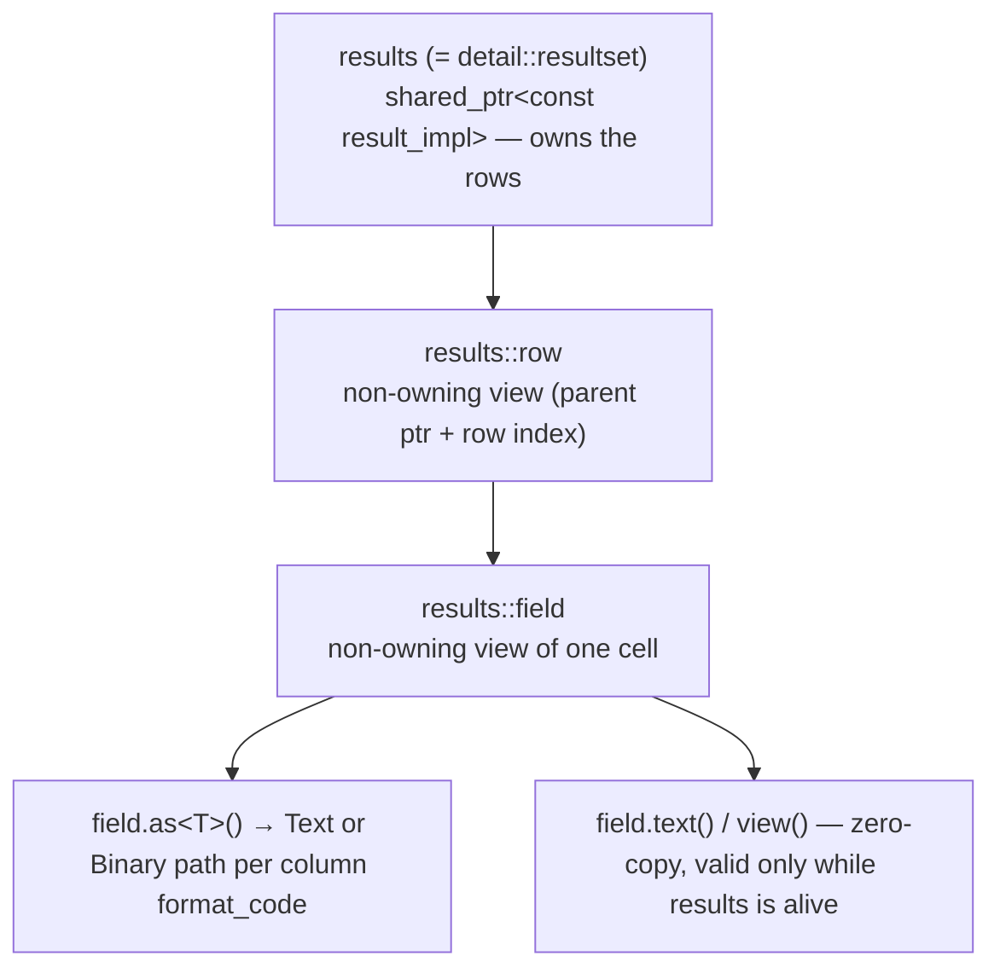

# Result sets and field access

> **Audience:** Adopter · **Status:** stable · **Verified-against:** qbm-pgsql @ qb 3.0.0 (C++20 default, C++23
> supported)

How to read rows and columns from `qb::pg::results` — the container a query hands back — using container iteration,
indexed access, and typed `field.as<T>()` conversions, with NULL handled through `std::optional<T>`.

**Prerequisites:** [queries.md](./queries.md) (how a query produces a result), [README.md](./README.md) (module setup) —
**See also:** [types.md](./types.md) (the `TypeConverter<T>` set that backs
`as<T>()`), [error_handling.md](./error_handling.md) (`value_is_null`, type
mismatches), [transaction.md](./transaction.md) (the `status` / `await()` path).

---

## Summary

A query returns a `qb::pg::results` object. `results` is a public alias (`pgsql.h:2604`) for the result-set class, which
is defined as `qb::pg::resultset` (`resultset.h:104`). The form `detail::resultset` resolves to the same type via a
`using namespace qb::pg;` directive (`pgsql.h:392`). Either spelling (`qb::pg::results`, `qb::pg::resultset`) is valid;
`results` is the recommended public name. You reach a result set through three paths:

- **Callback** — the success callback's second parameter, `(qb::pg::transaction&, qb::pg::results)`.
- **Coroutine** — `co_await tr.execute(...)` yields a `Reply<resultset>`; on success `reply.result()` is the result set.
- **Blocking** — `Transaction::await()` returns a `status`; on success `status.results()` is the result set.

`results` is a row-wise container. Each `results::row` is a container of `results::field` cells. Both `row` and `field`
are non-owning views into the parent `results` — they hold a pointer plus indices and own no buffer, so they must not
outlive the `results` object that vended them (`resultset.h:317-319`).

You include nothing extra: `#include <qbm/pgsql/pgsql.h>` pulls `resultset.h` through the transaction stack.

---

## Concepts

### Ownership: owning vs borrowing result sets

`results` is internally a `std::shared_ptr<const result_impl>` (`resultset.h:824`), so copying one is cheap and copies
are safe. There are two flavors:

- An **owning** result set holds a real allocation and keeps its rows alive. The default constructor, `deep_snapshot()`,
  and the coroutine path all produce owning result sets.
- A **borrowing** result set wraps a caller-owned `result_impl` with a no-op deleter (`resultset.cpp:223-227`). It
  observes the live row buffer but neither frees nor extends it. The result set handed to a synchronous success callback
  is borrowing.

This matters when you hand rows off past the synchronous callback's return: call `deep_snapshot()` to take an owning
copy first (`resultset.h:161`).

```cpp
<!-- src: qbm/pgsql/src/qbm/pgsql/resultset.h:161 -->
qb::pg::results owned = borrowed.deep_snapshot();   // safe to keep after the callback returns
```

The coroutine path does this for you: a successful `co_await` delivers `rs.deep_snapshot()`, so the `Reply<resultset>`
owns a deep copy and stays valid after the transaction's transient buffers are reused (
`src/qbm/pgsql/commands.h:1309,1337,1412`).

### `operator bool` reflects rows, not DML success

`results::operator bool` and `operator!` report only whether the set is non-empty (`resultset.h:268,284`). A `SELECT 1`
is truthy; an `INSERT`/`UPDATE`/`DELETE` without `RETURNING` is falsy even when it changed rows. To detect a DML effect,
use `rows_affected()` (`resultset.h:298`), which returns the count parsed from the `CommandComplete` tag (`5` from
`INSERT 0 5`).

### Binary vs text decoding is per column

Each column carries a `field_description::format_code` (`Text` or `Binary`). `field::as<T>()` branches on it: binary
fields go through `TypeConverter<T>::from_binary`, text fields through `from_text` (`resultset.h:572,621,631`). After an
extended-query execute, the client rewrites the row description's format codes to match what `Bind` requested, so
columns from a prepared/parameterized query are often binary while the same columns from a simple query stay text. You
do not choose the format — `as<T>()` reads it and dispatches correctly.

---

## Reading a result set

### From a coroutine

`co_await` returns a `Reply<resultset>`. Check `reply.ok()` (or `if (reply)`), then take the rows with `reply.result()`.
The `&&` overload (`std::move(reply).result()`) moves the value out; the `&` overload returns an lvalue reference (
`pg_reply.h:83,92`).

```cpp
<!-- src: qbm/pgsql/tests/integration/api/coro-api.cpp:104-118 -->
#include <qbm/pgsql/pgsql.h>

auto reply = co_await db->query("SELECT id, name FROM users LIMIT 3");
if (!reply.ok())
    co_return;

qb::pg::results rows = std::move(reply).result();
for (qb::pg::results::row const &row : rows) {
    auto id   = row["id"].as<qb::pg::integer>();
    auto name = row["name"].as<std::string>();
    // ...
}
```

### From a callback

The success callback receives the result set by value as its second argument. The error callback takes
`error::db_error const&`.

```cpp
<!-- src: qbm/pgsql/tests/integration/transaction/transaction-basic.cpp:58-64 -->
#include <qbm/pgsql/pgsql.h>

db.execute(
    "SELECT id, name FROM users",
    [](qb::pg::transaction &tr, qb::pg::results result) {
        for (auto const &row : result) {
            auto id = row["id"].as<qb::pg::integer>();
            (void) row["name"].as<std::string>();
        }
    },
    [](qb::pg::error::db_error const &e) { /* handle */ });
```

The `result` here is borrowing. If you need the rows after this lambda returns, snapshot first:
`qb::pg::results kept = result.deep_snapshot();`.

### From `await()` (blocking)

For a blocking drain, pass the discard sentinels and call `await()`. The returned `status` is convertible to `bool`;
`status.results()` returns the result set for that drain (`transaction.h:760`).

```cpp
<!-- src: qbm/pgsql/src/qbm/pgsql/transaction.h:760 -->
#include <qbm/pgsql/pgsql.h>

auto st = db.execute("SELECT 1 AS x", qb::pg::discard_query, qb::pg::discard_error).await();
if (st) {
    qb::pg::results r = st.results();
    int x = r[0]["x"].as<int>();
}
```

`status::operator bool` is truthy only when the batch drained with no failed sub-result and
`_error.sqlstate == sqlstate::unknown_code` (the success sentinel) — always test it before calling `results()` (
`transaction.h:750-751`).

---

## The `results` container

`results` (alias of `resultset`) is a row-wise container, modeled on a standard C++ container. Only `results` owns
storage; `row` and `field` are non-owning views into it and must not outlive it:



| Capability       | Members                                                                                                  | Notes                                                    |
|:-----------------|:---------------------------------------------------------------------------------------------------------|:---------------------------------------------------------|
| **Size**         | `size()`, `empty()`                                                                                      | Row count; `empty()` is `size() == 0`.                   |
| **Iteration**    | `begin()`/`end()`, `rbegin()`/`rend()`                                                                   | Bidirectional, not random-access (see pitfalls).         |
| **First / last** | `front()`, `back()`                                                                                      | Assert (not throw) on an empty set — guard first.        |
| **Indexed row**  | `operator[](size_type)`, `at(size_type)`                                                                 | `operator[]` asserts; `at()` throws `std::out_of_range`. |
| **DML count**    | `rows_affected()`                                                                                        | `int64_t` from the `CommandComplete` tag.                |
| **Columns**      | `columns_size()`, `field(i)`, `field(name)`, `field_name(i)`, `row_description()`, `index_of_name(name)` | Column metadata.                                         |
| **Truthiness**   | `operator bool`, `operator!`                                                                             | Non-empty test only (not DML success).                   |
| **JSON**         | `json()` → `qb::json`                                                                                    | Array of objects; NULL → JSON null.                      |
| **Snapshot**     | `deep_snapshot()`                                                                                        | Owning deep copy for async hand-off.                     |

```cpp
if (rows.empty())
    return;

for (qb::pg::results::row const &row : rows) {
    process(row);
}
// or by index:
qb::pg::results::row first = rows.at(0);          // checked
```

`index_of_name(name)` returns the column index, or `results::npos` if the name is absent (`resultset.cpp:311-320`) —
useful for a presence check that does not throw. `field(name)` (metadata-by-name) instead throws `std::runtime_error`
when the name is missing (`resultset.cpp:335`).

---

## The `row` view

A `results::row` is a non-owning, index-based container of fields.

- `row[i]` — field by 0-based index; throws `std::out_of_range` if out of range (`resultset.cpp:78`).
- `row["name"]` — field by case-sensitive column name. If the name is unknown, `index_of_name` returns `npos` and the
  subsequent indexed access throws `std::out_of_range`.
- `row.size()`, `row.empty()`, `row.begin()`/`row.end()` — field container interface.
- `row.row_index()` — this row's 0-based index in the result set.
- `row.index_of_name(name)` — shortcut to the parent's `index_of_name`.

### Whole-row extraction with `to(...)`

`row::to(...)` fills several typed targets at once. There are positional and named forms (`resultset.h:389-404`):

```cpp
<!-- src: qbm/pgsql/src/qbm/pgsql/resultset.h:389 -->
// positional: columns 0,1,2 in order
int         id;
std::string name;
bool        active;
row.to(id, name, active);

// or into a tuple
std::tuple<int, std::string, bool> t;
row.to(t);

// named: pick columns by name (order-independent)
row.to({"id", "name", "active"}, id, name, active);
```

The named form requires at least as many names as targets, or it throws `error::db_error` with message
`"Not enough names in row data extraction"` (`resultset.h:956`). Each target decodes through the same path as
`field::as<T>()`, so a NULL into a non-`std::optional` target throws `value_is_null` (see below).

### Typed tuples & structured bindings

For a value-returning, structured-binding-friendly form, decode a row (or a whole result) as a `std::tuple`:

```cpp
// One row -> a typed tuple (structured binding on the std::tuple).
auto [id, name] = row.as<std::tuple<int, std::string>>();

// First row of a result, or std::nullopt if empty.
if (auto r = res.one<int, std::string>())
    auto [id, name] = *r;

// Every row, eager, ready for structured-binding iteration.
for (auto [id, name] : res.all<int, std::string>())
    std::cout << id << ' ' << name << '\n';

// Lazy view (no intermediate vector) — borrows the result set.
for (auto [id, name] : res.rows<int, std::string>())
    std::cout << id << ' ' << name << '\n';
```

`row::as<Tuple>()` requires a `std::tuple<...>` (a `static_assert` rejects scalars — use `row[i].as<T>()` for a single
column). Each element decodes through `field::as<T>()`; use `std::optional<T>` in the tuple to read a nullable column.
`res.one<Ts...>()` returns `std::optional<std::tuple<Ts...>>`; `res.all<Ts...>()` returns
`std::vector<std::tuple<Ts...>>`; `res.rows<Ts...>()` returns a lazy `std::ranges` view of `std::tuple<Ts...>` (valid
only while the result set is alive).

---

## The `field` view

A `results::field` is a non-owning view of one cell. Its core members:

| Member                         | Returns / behavior                                                                                                                                                                    |
|:-------------------------------|:--------------------------------------------------------------------------------------------------------------------------------------------------------------------------------------|
| `as<T>()`                      | Decode the cell to `T`; throws `error::value_is_null` if NULL and `T` is not nullable.                                                                                                |
| `to(T &val)`                   | Out-parameter form; for nullable `T` writes a null sentinel, otherwise throws on NULL.                                                                                                |
| `to(std::optional<T> &val)`    | NULL-safe out-parameter; empty optional on NULL.                                                                                                                                      |
| `text()`                       | **Zero-copy** `std::string_view` of the field bytes (no allocation). Valid only while the result set is alive. Prefer over `as<std::string>()` to read a text column without copying. |
| `view()`                       | **Zero-copy** `std::span<const std::byte>` of the raw field bytes on the wire (text or binary per the column's format). Valid only while the result set is alive.                     |
| `is_null()`                    | `true` if the cell is SQL NULL.                                                                                                                                                       |
| `empty()`                      | `true` if the cell is empty (and not null).                                                                                                                                           |
| `name()`                       | Column name (`std::string const&`).                                                                                                                                                   |
| `description()`                | `field_description const&` (type OID, format code, etc.).                                                                                                                             |
| `row_index()`, `field_index()` | Position of this cell.                                                                                                                                                                |

### Typed conversion: `as<T>()`

`as<T>()` is the primary accessor. It reads the field's `format_code`, picks the binary or text path, and returns
`std::decay_t<T>` (`resultset.h:551-563`):

```cpp
<!-- src: qbm/pgsql/tests/integration/datatypes/datatypes-roundtrip.cpp:284-289 -->
qb::pg::smallint s   = result[0][0].as<qb::pg::smallint>();
qb::pg::integer  i   = result[0][0].as<qb::pg::integer>();
qb::pg::bigint   b   = result[0][0].as<qb::pg::bigint>();
double           d   = result[0][0].as<double>();
std::string      str = result[0][0].as<std::string>();
std::vector<qb::pg::byte> raw = result[0][0].as<std::vector<qb::pg::byte>>();
```

The supported `T` set is defined by the `TypeConverter<T>` specializations — see [types.md](./types.md). PostgreSQL
`timestamptz` (OID 1184) maps to `qb::wall_time` (integer-microsecond round-trip); use `as<qb::wall_time>()`. The
retired tokens `qb::Timestamp`, `qb::UtcTimestamp`, `to_timestamp(...)`, and similar are no longer part of the API — do
not use them.

### NULL handling

A direct `as<T>()` (or `to(T&)`) on a NULL cell, where `T` is not nullable, throws `error::value_is_null(name())` (
`resultset.h:562`, `resultset.h:652`). To read a possibly-NULL cell without exceptions, extract into `std::optional<U>`:

```cpp
<!-- src: qbm/pgsql/src/qbm/pgsql/resultset.h:551 -->
// as<optional> — empty when NULL
std::optional<std::string> maybe = field.as<std::optional<std::string>>();
if (maybe)
    use(*maybe);

// or the out-parameter form
std::optional<int> v;
field.to(v);                 // v is empty if the cell is NULL

// or test explicitly first
if (!field.is_null())
    use(field.as<int>());
```

`results::json()` uses exactly this pattern internally — it extracts every cell as `std::optional<std::string>`, so NULL
cells become JSON null (`resultset.cpp:362-375`).

### Type mismatches

If the requested `T` cannot be decoded for the cell's wire type, the conversion layer throws —
`error::field_type_mismatch` for a type clash, or `error::db_error` when a binary cell has no binary parser for `T`.
See [error_handling.md](./error_handling.md).

---

## JSON export

`results::json()` converts the whole set to a `qb::json` array of objects (one object per row, keyed by column name),
with NULL rendered as JSON null:

```cpp
<!-- src: qbm/pgsql/src/qbm/pgsql/resultset.cpp:362 -->
qb::json j = rows.json();   // e.g. [{"id":1,"name":"ada"}, ...]
```

This is convenient for diagnostics, admin endpoints, or quick serialization. In hot paths prefer typed `as<T>()` —
`json()` stringifies every cell.

---

## Pitfalls

- **Views must not outlive the result set.** `row` and `field` are pointers-plus-indices into the parent `results`.
  Storing a `row` or `field` past the lifetime of the `results` that vended it is a use-after-free. Copy the data out,
  or snapshot the whole set (`resultset.h:317-319`).
- **The callback result set is borrowing.** It does not extend the lifetime of the live row buffer. To retain rows after
  a synchronous success callback returns, call `deep_snapshot()` first (`resultset.cpp:223-227`).
- **`operator[]`, `front()`, `back()` assert; they do not throw.** `results::operator[]` only asserts on an out-of-range
  index (UB in a release build past the end); `front()`/`back()` assert on an empty set. Use `at()` for a checked row,
  and guard `front()`/`back()` with `empty()` or `operator bool` (`resultset.cpp:271-286`).
- **`operator bool` is a row-presence test, not DML success.** A successful DML statement with no returned rows is
  falsy. Use `rows_affected()` to detect an effect (`resultset.h:268,298`).
- **Iterators are bidirectional, not random-access.** Comparing iterators from different result sets — or, for field
  iterators, different rows — trips an assert (`resultset.cpp:96,181-182`).
- **Do not share a result set across cores/threads.** Text-format `as<T>()` uses a function-local
  `static ParamUnserializer`; this is safe only because an actor/connection runs on a single `VirtualCore` (one thread).
  Sharing a `results` across cores is a data race (`resultset.h:629`).
- **NULL into a non-`std::optional` target throws.** Always decode possibly-NULL columns as `std::optional<U>`, or guard
  with `is_null()` (`resultset.h:562`).
- **Retired time tokens are gone.** `timestamptz` maps to `qb::wall_time`; `qb::Timestamp` / `qb::UtcTimestamp` /
  `to_timestamp(...)` no longer exist in this API.

---

## See also

- [types.md](./types.md) — the `TypeConverter<T>` set behind `as<T>()`, parameter binding, `qb::wall_time` mapping,
  tuple decode.
- [error_handling.md](./error_handling.md) — `value_is_null`, `field_type_mismatch`, the `db_error` hierarchy.
- [queries.md](./queries.md) — `execute` / prepared paths that produce a result set.
- [transaction.md](./transaction.md) — the callback, coroutine, and `await()` / `status` execution models.
