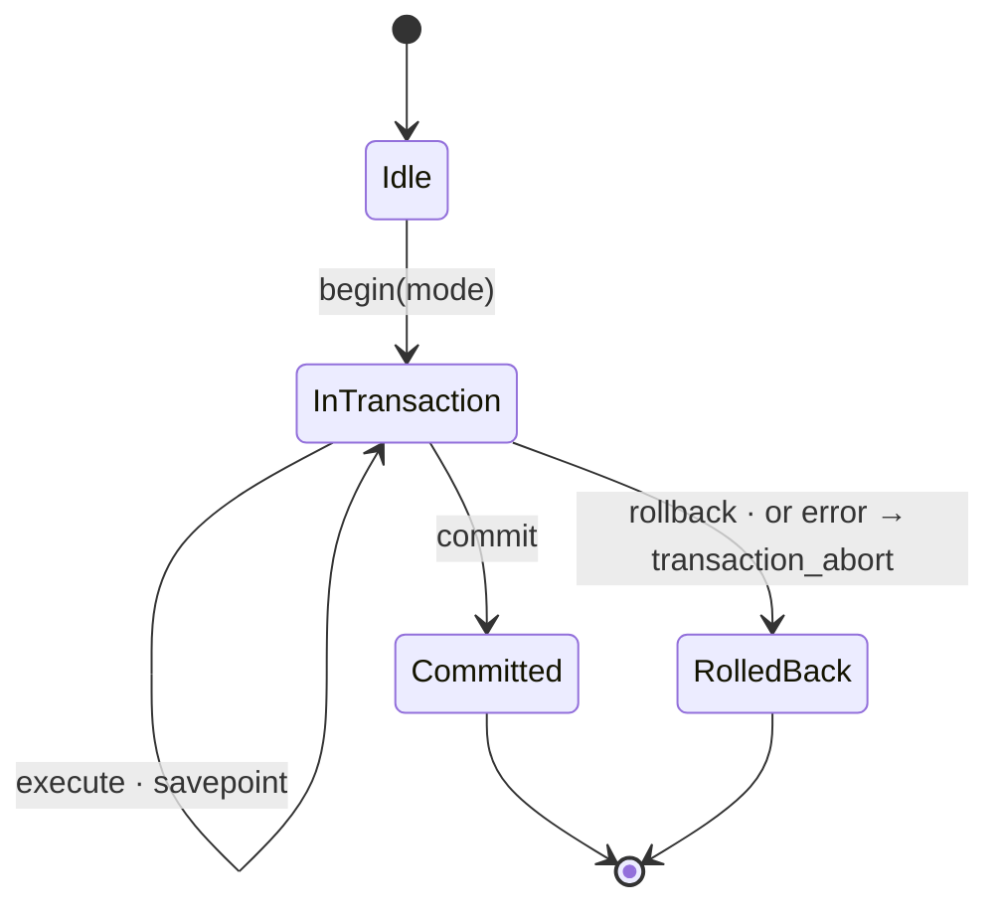
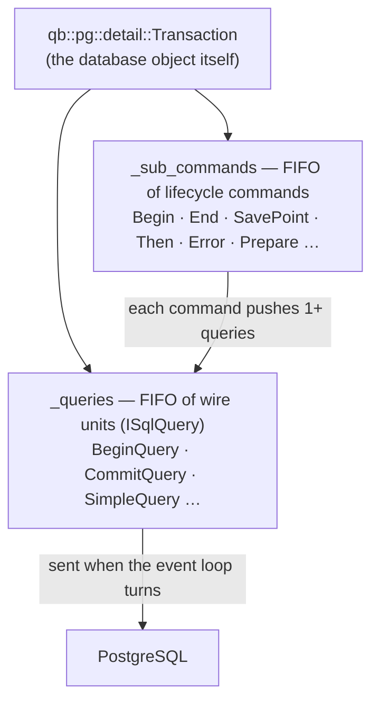

# Transactions and command queues

> **Audience:** Adopter · **Status:** stable · **Verified-against:** qbm-pgsql @ qb 3.0.0 (C++20 default, C++23
> supported)

How `qb::pg::detail::Transaction` drives `BEGIN`/`COMMIT`/`ROLLBACK`, savepoints, isolation modes, statement timeout,
and `LISTEN`/`NOTIFY` — through both the fluent callback API and the `co_await` coroutine API.

**Prerequisites:** [connection.md](./connection.md) (you need a connected `database`) — **See also:
** [queries.md](./queries.md), [results.md](./results.md), [error_handling.md](./error_handling.md), [types.md](./types.md)

---

## Summary

A `qb::pg::tcp::database` (and `qb::pg::tcp::ssl::database` on an OpenSSL build) **is** the root
`qb::pg::detail::Transaction`. The same object owns the socket, the wire-protocol state, the prepared-statement storage,
and two FIFO queues that every operation extends. `begin`, `execute`, `savepoint`, `listen`, and `notify` each enqueue
work; the work runs later when the qb-io event loop turns.

Two API styles sit on top of those queues:

- **Callback (fluent):** `db.begin(on_success, on_error, mode)` and friends return `Transaction&` immediately so calls
  chain. Completion fires the callbacks when the loop runs. Inside a `begin` success callback you receive a
  `qb::pg::transaction&` (the alias for `detail::Transaction`) on which you enqueue the body of the block.
- **Coroutine (`co_await`):** `db.begin()`, `db.execute(sql)`, `db.commit()`, and friends return an awaiter; `co_await`
  -ing it yields a `qb::pg::Reply<T>`. Check `r.ok()` (or `if (r)`) before reading `r.result()`.

The public include is `#include <qbm/pgsql/pgsql.h>`; the public namespace is `qb::pg` (`qb::pg::detail` for the
`Transaction` base itself). The aliases you use day to day are `qb::pg::transaction` (the callback parameter type),
`qb::pg::params` (prepared-statement arguments), and `qb::pg::Reply<T>` (coroutine results).



---

## Concepts

### One object, two queues

<!-- src: src/qbm/pgsql/transaction.h:77-99, src/qbm/pgsql/transaction.cpp:81-116 -->

`Transaction` holds:

- `_sub_commands` — a queue of nested `Transaction` command objects (`Begin`, `End`, `SavePoint`, `EndSavePoint`,
  `Then`, `Error`, `Prepare`, …) processed in FIFO order. These own your callbacks and the block lifecycle.
- `_queries` — a queue of `ISqlQuery` instances (`BeginQuery`, `CommitQuery`, `RollbackQuery`, `SavePointQuery`,
  `SimpleQuery`, …) that are the wire-level units actually sent to PostgreSQL.



A command (lifecycle unit) pushes one or more queries (wire units). `Transaction` is **non-copyable and non-movable** —
the default, copy, and move constructors and assignment operators are all deleted (`src/qbm/pgsql/transaction.h:81-89`). Hold it
by reference or pointer; never by value.

### The loop drives completion

Nothing in the callback path blocks. Each `execute(..., cb, err)` returns `Transaction&` the instant it has enqueued the
command. The command completes when something turns the qb-io event loop — your actor's `VirtualCore`, a standalone
`qb::io::async::listener`, or an explicit drain (see `await` below). If your application already runs the loop (the
normal case inside an actor), you do **not** call `await` after every statement.

### Status and `await`

<!-- src: src/qbm/pgsql/transaction.cpp:176-213, src/qbm/pgsql/transaction.h:712-781 -->

`Transaction::await()` is a **blocking drain on the current thread**: it pumps
`qb::io::async::listener::current.run(EVRUN_ONCE)` until both queues are empty, then returns a `status` snapshot. It is
the synchronous bridge for tests and scripts, not the path you use inside a running actor.

`status` reports success only when the batch drained with no failed sub-result **and** no PostgreSQL/client error was
recorded (the success sentinel is `_error.sqlstate == sqlstate::unknown_code`):

```cpp
auto st = db.execute("SELECT 1", qb::pg::discard_query, qb::pg::discard_error).await();
if (st) {                       // explicit operator bool
    auto rows = st.results();   // qb::pg::results
} else {
    auto const& e = st.error(); // qb::pg::error::db_error
}
```

`await()` is careful about work that completed *synchronously* before it was called: if the queues were already empty on
entry but a failure was recorded (for example client-side validation of a prepared statement), it restores that failure
into the snapshot instead of reporting a false success. `qb::pg::await(db)` is a free-function forwarder to
`db.await()`.

### `Reply<T>` (coroutine results)

<!-- src: src/qbm/pgsql/pg_reply.h:19-104 -->

Coroutine overloads return `pg_reply_awaiter<T>`; awaiting one yields `qb::pg::Reply<T>`:

- `r.ok()` / `if (r)` — success flag.
- `r.result()` — the value (`resultset` for queries, `PreparedQuery` for `prepare`); `Reply<void>` carries no value (
  used by `notify`, `listen`, and `with_transaction` over `task<void>` bodies).
- `r.error()` — `qb::pg::error::db_error` on failure.

Coroutine results are delivered through `resultset::deep_snapshot()`, so a `Reply<resultset>` owns a deep copy that
stays valid after the transaction's transient buffers are reused.

> **Awaiter vs `task`.** The single-op entry points (`execute`, `query(sql)`, `prepare`, `begin`/`commit`/`rollback`,
> savepoints, `notify`/`listen`) return `pg_reply_awaiter<T>`. The helpers that chain multiple awaits internally —
`copy_out`, `copy_in`, `query_stream`, and the inline `query(sql, args...)` — return `qb::io::async::task<Reply<T>>`
> instead. Both are `co_await`-only and yield the same `Reply<T>`, so this distinction does not change how you call
> them.

---

## The callback transaction block: `begin` / `End`

<!-- src: src/qbm/pgsql/commands.h:760-787, src/qbm/pgsql/commands.h:49-158 -->

`begin` does **not** take a `commit` callback. It pushes a `Begin` command, which itself queues an `End` command:

1. `begin(on_success, on_error, mode)` pushes `Begin` (carrying `on_success` and the `mode`) plus a paired `End` (
   carrying `on_error`).
2. `Begin`'s constructor queues a `BeginQuery` that emits `BEGIN <mode>` (plus an optional
   `SET LOCAL statement_timeout`, see below).
3. When `BeginQuery` succeeds, the framework calls `on_success(*this)`, where `*this` is the `Begin` command exposed as
   `qb::pg::transaction&`. Your lambda enqueues the block body (`tr.execute`, `tr.savepoint`, …) onto **that** inner
   context.
4. When `Begin` is popped from its parent queue, `Begin::on_before_pop` copies the running result into `End` and calls
   `End::on_end_transaction`, which queues a `CommitQuery` on success or a `RollbackQuery` on failure.

So **COMMIT/ROLLBACK in callback style is the `End` command**, chosen automatically from the block's accumulated
result — there is no `commit(cb, err)`. Explicit `co_await db.commit()` / `db.rollback()` exist only on the coroutine
path.

**Error routing.** A failed `BeginQuery` routes to the `on_error` you passed to `begin`; commit/rollback failures route
to the same `End` error callback. If your `on_success` body **throws**, `Begin` catches it, marks the block failed, and
forwards a `qb::pg::error::client_error` carrying `what()` to `End`'s error callback (`src/qbm/pgsql/commands.h:108-119`).

```cpp
#include <qbm/pgsql/pgsql.h>

void run(qb::pg::tcp::database& db) {
    db.begin(
        [](qb::pg::transaction& tr) {
            tr.execute("INSERT INTO accounts(id, balance) VALUES (1, 100)",
                       qb::pg::discard_query, qb::pg::discard_error);
            tr.execute("UPDATE accounts SET balance = balance - 10 WHERE id = 1",
                       qb::pg::discard_query, qb::pg::discard_error);
        },
        [](qb::pg::error::db_error const& err) {
            // BEGIN failed, or COMMIT/ROLLBACK reported an error
            (void) err;
        },
        qb::pg::transaction_mode{}); // default mode → plain BEGIN
}
```

A two-argument `begin(on_success, mode)` overload exists; it installs an empty error callback.

### `then` / `success` / `error` chaining

<!-- src: src/qbm/pgsql/transaction.h:668-689, src/qbm/pgsql/commands.h:450-540 -->

- `then(cb)` and `success(cb)` (aliases) push a `Then` command. When it is popped, if the parent's result is still
  success, `cb(*parent())` runs with the same `Transaction&` you chained from.
- `error(cb)` pushes an `Error` command. When popped, if the parent's result is failure, `cb(parent()->error())` runs.

These lambdas execute **when the command is popped during queue draining**, in FIFO order relative to the other
sub-commands — not inline after the C++ statement. Where you chain matters:

| Call site                            | `parent()` for `then`/`error` | Meaning                                                                                                                                                                                 |
|:-------------------------------------|:------------------------------|:----------------------------------------------------------------------------------------------------------------------------------------------------------------------------------------|
| `db.begin(...).then(f).error(g)`     | the root `database`           | `Then`/`Error` are enqueued *after* the `Begin`/`End` pair, so they run after the whole block has committed or rolled back. Use for follow-up work that depends on the block finishing. |
| `tr.then(f)` inside the `begin` body | the `Begin` sub-transaction   | Chains within the block's own subtree — use for intra-block sequencing before `End` runs.                                                                                               |

There is no separate "next" type: `then` passes `*parent()`, the parent transaction reference.

---

## The coroutine transaction block

<!-- src: src/qbm/pgsql/commands.h:1341-1362, tests/integration/api/coro-api.cpp:221-245 -->

The coroutine path is imperative: `begin` / `execute` / `commit` (or `rollback`) are explicit, and you branch on `ok()`.

```cpp
#include <qbm/pgsql/pgsql.h>
#include <qb/io/async.h>

qb::io::async::task<void> transfer(qb::pg::tcp::database& db) {
    auto b = co_await db.begin();
    if (!b.ok())
        co_return;

    auto upd = co_await db.execute(
        "UPDATE accounts SET balance = balance - 10 WHERE id = 1");
    if (!upd.ok()) {
        (void) co_await db.rollback();
        co_return;
    }

    auto c = co_await db.commit();
    if (!c.ok())
        (void) co_await db.rollback();
}
```

`commit()` and `rollback()` are coroutine-only (`co_await` → `Reply<resultset>`); there are no callback twins. Use the
`End` command (the callback `begin` path) when you want implicit commit/rollback in callback style.

### `with_transaction` (coroutine sugar)

<!-- src: src/qbm/pgsql/with_transaction.h:103-139, tests/integration/api/coro-api.cpp:286-323 -->

`qb::pg::with_transaction(db, body)` wraps the begin → body → commit/rollback dance. It runs `BEGIN`, awaits your
`body(tr)` (which must return `qb::io::async::task<T>`), then `COMMIT`. On `begin` failure, `commit` failure, a thrown
`qb::pg::transaction_abort`, or any other C++ exception after `begin`, it issues a best-effort `ROLLBACK` and returns a
failed `Reply<T>` (or rethrows non-`transaction_abort` exceptions).

To abort a block from a statement failure without a noisy throw, raise `transaction_abort{reply.error()}` — the scope
rolls back and you get a failed `Reply` instead of an attempted `COMMIT` on an aborted transaction:

```cpp
#include <qbm/pgsql/pgsql.h>
#include <qb/io/async.h>

qb::io::async::task<int>
charge(qb::pg::tcp::database& db) {
    auto r = co_await qb::pg::with_transaction(
        db,
        [](qb::pg::detail::Transaction& tr) -> qb::io::async::task<int> {
            auto ins = co_await tr.execute(
                "INSERT INTO ledger(amount) VALUES (99) RETURNING amount");
            if (!ins.ok())
                throw qb::pg::transaction_abort{ins.error()};
            co_return 99;
        });

    if (!r.ok())
        co_return -1;          // rolled back; r.error() has the cause
    co_return r.result();      // committed; body's value
}
```

A `with_transaction(db, mode, body)` overload opens the block with a non-default `transaction_mode`. Inside the body,
`tr.query("…")` is a convenience alias for `tr.execute("…")` so `with_transaction` bodies read naturally.

To put a statement timeout on a `with_transaction` block, call `db.set_timeout(...)` **before** the
`with_transaction(...)` call — it arms the `BEGIN` that the scope opens (see [Statement timeout](#statement-timeout));
it has no effect on autocommit statements run outside a block.

> **Nesting.** Do not issue a second `BEGIN` on the same connection inside an open block — PostgreSQL does not support
> nested transaction blocks. `with_transaction` now **rejects** this up front: called on a connection already in a
> transaction (`in_transaction()`), it fails fast with a `client_error` rather than sending a second `BEGIN` that
> PostgreSQL would warn `25001` on and silently flatten (the inner scope's COMMIT/ROLLBACK would end the *outer*
> transaction, losing isolation). Use savepoints for nested units of work.
<!-- src: src/qbm/pgsql/with_transaction.h:84-92, src/qbm/pgsql/transaction.h:167-170 -->

---

## Savepoints

<!-- src: src/qbm/pgsql/commands.h:805-828, src/qbm/pgsql/commands.h:1364-1392, src/qbm/pgsql/commands.h:169-300 -->

**Callback — open a savepoint sub-block:**

```cpp
tr.savepoint("sp1",
    [](qb::pg::transaction& inner) {
        inner.execute("INSERT INTO t(v) VALUES (1)",
                      qb::pg::discard_query, qb::pg::discard_error);
    },
    [](qb::pg::error::db_error const&) { /* savepoint body failed */ });
```

`savepoint` mirrors `begin`: it pushes a `SavePoint`/`EndSavePoint` pair that issues `SAVEPOINT name` and, on the way
out, `RELEASE SAVEPOINT name` (success) or `ROLLBACK TO SAVEPOINT name` (failure). The `name` is **quoted as a SQL
identifier** (double-quoted, embedded `"` doubled, matching libpq's `PQescapeIdentifier`) before it enters the
simple-query string — on **both** the callback (`SavePointQuery` / `EndSavePointQuery`) and coroutine paths — so a name
can never inject a second statement.
<!-- src: src/qbm/pgsql/queries.h:483-500,538-541,576-579,614-617 -->

**Coroutine — explicit control:**

```cpp
auto sp  = co_await tr.savepoint("sp1");
auto ins = co_await tr.execute("INSERT INTO t(v) VALUES (1)");
if (!ins.ok())
    (void) co_await tr.rollback_savepoint("sp1");
else
    (void) co_await tr.release_savepoint("sp1");
```

**Name validation.** The coroutine `savepoint`, `release_savepoint`, and `rollback_savepoint` reject names that are
empty, longer than 63 characters, or contain anything other than alphanumerics and underscore. An invalid name returns a
pre-failed awaiter carrying `qb::pg::error::client_error` — no SQL is sent (`src/qbm/pgsql/commands.h:1238-1248,1364-1392`).
This pre-check is defense-in-depth on top of the identifier quoting above: even the callback path, which does *not*
pre-validate, cannot be made to inject SQL because the name is always quoted into a single literal identifier.

**API gap.** There are **no** callback overloads for `release_savepoint` / `rollback_savepoint` — only the `co_await`
forms. Inside a callback block, issue `RELEASE SAVEPOINT` / `ROLLBACK TO SAVEPOINT` through `execute` if you need them
on the fluent path.

---

## Isolation and transaction modes

<!-- src: src/qbm/pgsql/common.h:221-291, src/qbm/pgsql/common.cpp:108-137 -->

`qb::pg::transaction_mode` selects the isolation level and access flags rendered into the `BEGIN` statement:

```cpp
struct transaction_mode {
    isolation_level isolation = isolation_level::read_committed; // default
    bool read_only  = false;
    bool deferrable = false;  // only meaningful with serializable
};
```

`qb::pg::isolation_level` is `read_committed` (default), `repeatable_read`, or `serializable`. `to_string(mode)` emits
only the non-default tokens (`ISOLATION LEVEL …`, `READ ONLY`, `DEFERRABLE`), so a default-constructed mode produces a
plain `BEGIN`.

```cpp
using qb::pg::isolation_level;
using qb::pg::transaction_mode;

// Read-only serializable, deferrable (e.g. a long consistent report)
transaction_mode ro_serial{isolation_level::serializable,
                           /*read_only=*/true, /*deferrable=*/true};

// Callback
db.begin(on_ok, on_err, ro_serial);

// Coroutine
auto b = co_await db.begin(ro_serial);

// with_transaction
auto r = co_await qb::pg::with_transaction(db, ro_serial, body);
```

A read-only PostgreSQL transaction still permits writes to temporary tables; "read only" constrains writes to persistent
objects.

---

## Statement timeout

<!-- src: src/qbm/pgsql/transaction.h:634-659, src/qbm/pgsql/commands.h:1227-1236, src/qbm/pgsql/queries.h:374-407 -->

`set_timeout(qb::duration)` arms a PostgreSQL `statement_timeout` for the **next** `BEGIN` on this connection. The
following `begin()` (callback *or* coroutine) appends `; SET LOCAL statement_timeout = N` to the same simple-query
round-trip as `BEGIN`, so the limit is **transaction-scoped** and is cleared automatically at `COMMIT`/`ROLLBACK`.

```cpp
db.set_timeout(std::chrono::seconds{5}); // applies to the next begin()
auto b = co_await db.begin();            // BEGIN ; SET LOCAL statement_timeout = 5000
```

> **Arm it before the block.** `set_timeout` must be called **before** `begin()` / `with_transaction(...)` — it only
> colours the *next* `BEGIN`. It has **no effect on autocommit statements** (an `execute`/`query` issued without an open
> block); for those, send `SET statement_timeout` as raw SQL yourself.

Key facts to get right:

- The argument is a `qb::duration` (the canonical qb time model). It is truncated to whole milliseconds (
  `duration_cast<std::chrono::milliseconds>`); sub-millisecond precision is lost, and a positive value below 1 ms
  truncates to 0 and is therefore **omitted entirely** — no `SET LOCAL` is emitted.
- `set_timeout(qb::duration::zero())` or any zero/negative `qb::duration` disables the injection; new transactions fall
  back to the server default.
- Call `set_timeout` **before** `begin`. It affects only the next `BEGIN`, not statements issued in autocommit mode (no
  `begin()`); for those, issue `SET statement_timeout` as raw SQL.
- `get_timeout()` returns the stored value as a `qb::duration` (millisecond-rounded). `qb::duration::zero()` means none.
- This is a **server-side per-statement limit**, not a socket idle timeout and not the connect deadline. For the connect
  deadline, see [connection.md](./connection.md).

> Do not reach for retired time aliases here. The API is `qb::duration`. Tokens such as `qb::Timestamp`, `qb::Duration`,
`qb::TimePoint`, `to_timestamp(`, or `to_time_point(` are removed from the framework and must not appear in your code.

---

## LISTEN / NOTIFY

<!-- src: src/qbm/pgsql/transaction.h:420-477, src/qbm/pgsql/pg_notify_sql.h:51-80, qbm/pgsql/src/qbm/pgsql/pgsql.h:378-388 (notification), 1780-1791 (on_incoming_notify), 2461-2573 (notify_consumer / notify_co_consumer / notify_cb_consumer) -->

### Publishing (NOTIFY)

`notify` builds safe `NOTIFY "channel" [, 'payload']` SQL (the channel is quoted as an identifier and the payload as a
string literal). Use a **normal** `database` connection to publish, not a connection dedicated to consuming. An empty
payload omits the payload clause; payloads over `notify_payload_max_bytes` (8000) are rejected with a `client_error`.

```cpp
// Callback
db.notify("jobs", "id=42", qb::pg::discard_query, qb::pg::discard_error);

// Coroutine → Reply<void>
auto r = co_await db.notify("jobs", "id=42");
if (!r.ok()) { /* r.error() */ }

// No payload
co_await db.notify("jobs");
```

### Subscribing (LISTEN / receiving)

`listen`, `unlisten`, and `unlisten_all` register and clear channel subscriptions on a connection (each has both a
callback overload and a `co_await` → `Reply<void>` form). Subscribing
alone is not enough — you must give the connection somewhere to deliver inbound `NOTIFY` messages:

- A plain `database` only **logs** an inbound `NOTIFY` unless you set
  `on_incoming_notify(std::function<void(qb::pg::notification&&)>)`.
- `qb::pg::tcp::notify_co_consumer` (alias `notify_cb_consumer`) is a `database` subtype that adds an `on_notify(cb)`
  callback **and** a bounded queue you drain with `co_await sub.receive()`.

A delivered `qb::pg::notification` carries `server_backend_pid`, `channel`, and `payload`.

```cpp
#include <qbm/pgsql/pgsql.h>

qb::io::async::task<void> consume() {
    qb::pg::tcp::notify_co_consumer sub{/* dsn */};
    if (!co_await sub.connect(/* dsn */))
        co_return;
    if (!(co_await sub.listen("jobs")).ok())
        co_return;

    // Resolves to std::optional<notification>; std::nullopt when the
    // channel closes (e.g. on disconnect).
    while (auto n = co_await sub.receive()) {
        // n->channel, n->payload, n->server_backend_pid
    }
}
```

The consumer's queue defaults to 8192 messages. On overflow the newest message is dropped and `on_notify_dropped(cb)` (
if set) is invoked, otherwise a warning is logged. The channel closes on disconnect, so an in-flight `receive()`
resolves to `std::nullopt`.

---

## Pitfalls

- **Callback completion needs a running loop.** A fluent `db.begin(...)` enqueues work and returns immediately; if
  nothing turns the qb-io loop, the block never runs. Inside an actor the `VirtualCore` drives it; in a standalone test,
  drain with `await()` or `qb::io::async::run_sync(...)`.
- **No `commit(cb, err)`.** The callback path commits/rolls back through the implicit `End` command; only the coroutine
  path has explicit `commit()`/`rollback()`.
- **A failed transaction must be rolled back.** PostgreSQL parks a session in the "failed transaction" state (
  `ReadyForQuery` `'E'`) after an in-block error; the client does **not** auto-`ROLLBACK`. Issue `ROLLBACK` (or let
  `End`/`with_transaction` do it) before sending new commands.
- **A lost connection fails every pending query automatically.** You do **not** write a disconnect handler. The built-in
  `Database::on(qb::io::async::event::disconnected)` handler calls `fail_all_pending(...)` on the root transaction (
  `qbm/pgsql/src/qbm/pgsql/pgsql.h:2374`), which drains every queued query and pending sub-transaction so suspended `co_await`
  awaiters resume with `client_error("database disconnected")` instead of hanging forever.
  See [connection.md](./connection.md) (Fail-all-on-disconnect).
- **Statement timeout below 1 ms vanishes.** A sub-millisecond `set_timeout` truncates to 0 and emits no `SET LOCAL`.
  Use whole-millisecond durations.
- **Savepoint names are validated only on the coroutine path.** Callback `savepoint` does not pre-validate the name; an
  illegal identifier surfaces as a server error from PostgreSQL instead of a client-side `client_error`. It is still
  **injection-safe** either way — the name is quoted as a SQL identifier on both paths (see *Savepoints* above), so an
  unvalidated name is at worst a rejected identifier, never a second statement.
- **Coroutine results are snapshots.** `Reply<resultset>` owns a `deep_snapshot()`; do not assume it aliases the
  transaction's live buffers, and conversely do not hold a `resultset&` from a callback past the callback's return.
- **Overlapping `query_stream` calls share one transaction.** A session has a single transaction, so streams that
  overlap on one connection do **not** each open one: the first `BEGIN`s, later ones join, and the last one out commits
  — or rolls back if *any* of them failed. A caller-opened transaction is never joined and never ended, but it counts as
  caller-owned only once its `BEGIN` has **completed**, so never start a stream while your own `begin()` is still in
  flight. See [queries.md](./queries.md) (`query_stream`).

---

## See also

- [connection.md](./connection.md) — establishing the `database`, the connect deadline (vs statement timeout)
- [queries.md](./queries.md) — `execute`, prepared statements, parameter binding
- [results.md](./results.md) — reading `resultset` rows and fields
- [error_handling.md](./error_handling.md) — `db_error`, SQLSTATE, `status`, the `Error` command
- [types.md](./types.md) — PostgreSQL ↔ C++ type mapping (timestamps map to `qb::wall_time`)
