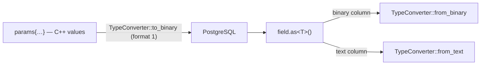

# Type mapping

> **Audience:** Adopter · **Status:** stable · **Verified-against:** qbm-pgsql @ qb 2.6.0 (C++20 default, C++23
> supported)

How `qbm-pgsql` maps C++ values to PostgreSQL OIDs and wire formats: outbound for bind parameters (`qb::pg::params`) and
inbound for result columns (`field::as<T>()`).

**Prerequisites:** [queries.md](./queries.md) (`prepare`, `params`, `execute`) — **See also:
** [results.md](./results.md) (reading rows), [error_handling.md](./error_handling.md) (`value_is_null`,
`field_type_mismatch`)

**Include:** `#include <pgsql/pgsql.h>` — the public surface (`params`, `oid`, `type_oid_sequence`, `results`) is in
namespace `qb::pg`. `qbm-pgsql` is a compiled static library (`qbm::pgsql`); link it with
`target_link_libraries(app PRIVATE qbm::pgsql)`. It is not header-only.

The serialization machinery (`TypeConverter`, `ParamSerializer`, `FieldHandler`) lives under `src/` and is referenced
here so you can navigate the implementation — application code never includes those files.

---

## Concepts

- **OID.** A PostgreSQL type identifier from the `pg_type` catalog (e.g. `23` = `int4`, `1184` = `timestamptz`).
  `qbm-pgsql` models the common ones as `enum class qb::pg::oid` ([`src/pg_types.h`](../src/pg_types.h)).
- **`type_oid_sequence`.** `using type_oid_sequence = std::vector<oid>` ([`src/common.h`](../src/common.h)). You pass
  one to `prepare()` to declare each parameter's type. <!-- src: src/common.h:519 -->
- **`params`.** `using params = detail::QueryParams` ([`pgsql.h`](../pgsql.h)). A heterogeneous container of bind values
  serialized to PostgreSQL **binary** wire form. <!-- src: pgsql.h:2612 -->
- **`type_mapping<T>`.** Compile-time C++-type → OID lookup ([`src/type_mapping.h`](../src/type_mapping.h)). Drives
  `get_type_oid<T>()` and `fill_types<T...>()`. The primary template is **intentionally ill-formed** (a `static_assert`):
  a C++ type with no mapping is a **hard compile error**, not a silent fallback to OID `705` (unknown). Add a
  `type_mapping<T>` specialization for any new supported type. <!-- src: src/type_mapping.h:58-63 -->
- **`numeric` is mapped too.** Its `type_mapping<numeric>` specialization lives in
  [`src/type_converter.h`](../src/type_converter.h) (where `numeric` is declared), so `get_type_oid<numeric>()` returns
  `1700`, not `705`. <!-- src: src/type_converter.h:1190-1193 -->
- **`TypeConverter<T>`.** The encode/decode engine ([`src/type_converter.h`](../src/type_converter.h)): `to_binary` /
  `to_text` (send) and `from_binary` / `from_text` (receive). Unsupported types fail to compile via `static_assert`.

Two facts shape everything below:

1. **Bind parameters are always sent in binary** — a single format code (1) for every parameter. There is no text
   fallback on the send path, so a value's binary encoding must match what the server expects for its declared OID.
2. **Result columns are decoded per column** by `format_code`. The client requests binary for scalar OIDs and text for
   string-like / catalog OIDs in `Bind`; see [Binary versus text on the wire](#binary-versus-text-on-the-wire).



---

## Time and timestamps

PostgreSQL `timestamptz` (OID `1184`) maps to **`qb::wall_time`** — the framework's canonical UTC instant (
`std::chrono::system_clock::time_point`). <!-- src: src/type_mapping.h:142-145 -->

```cpp
// type_mapping.h
template <> struct type_mapping<qb::wall_time> { static constexpr integer type_oid = 1184; }; // timestamptz
```

On the wire a timestamp is an `int64` big-endian count of **microseconds since 2000-01-01 00:00:00 UTC** (the PostgreSQL
epoch). The converter performs an exact integer shift between that epoch and the Unix epoch (`946684800` seconds) with
no floating-point rounding. <!-- src: src/type_converter.h:236-244 -->

Reads of **both** `timestamp` (OID `1114`) and `timestamptz` (OID `1184`) columns decode into `qb::wall_time` — the two
share an identical micros-since-2000 wire layout. <!-- src: src/type_converter.h:771-773 -->

```cpp
#include <pgsql/pgsql.h>
using namespace qb::pg;

// Read a timestamptz column. (src: tests/integration/datatypes/datatypes-roundtrip.cpp:403)
qb::wall_time created = result[0][0].as<qb::wall_time>();
```

> **The retired time tokens are gone.** `qb::Timestamp`, `qb::UtcTimestamp`, `qb::LocalTimestamp`, `qb::Duration`,
`qb::TimePoint`, and helpers like `to_timestamp(...)` / `to_time_point(...)` no longer exist anywhere in `qbm-pgsql`.
> Use `qb::wall_time` for every timestamp. The "micros-since-2000" value is an **internal wire encoding** computed
> inside
`TypeConverter`; it is never a `qb::duration` and is never surfaced to your code.

`connect`, `statement`, and `transaction` timeouts are a different concern — they are `qb::duration` (
see [connection.md](./connection.md) and [transaction.md](./transaction.md)), not part of the type-mapping table.

---

## OID ↔ C++ type table

The table below is the **complete set of types that `type_mapping<T>` recognizes** (the send-side auto-deduction
surface) plus how each decodes inbound. Every row has a `type_mapping<T>` specialization, so `get_type_oid<T>()` returns
the listed OID. A C++ type with **no** specialization is a **compile error** when auto-deduced (the primary template
`static_assert`s), not a silent OID `705`; to bind such a value you must declare its OID explicitly — see [Types with no
auto-deduction](#types-without-auto-deduction).

| C++ type                                                           | PostgreSQL         |    OID     |   Bind via `params`   |         `as<T>()` decode          |
|:-------------------------------------------------------------------|:-------------------|:----------:|:---------------------:|:---------------------------------:|
| `bool`                                                             | `boolean`          |     16     |          yes          |                yes                |
| `int16_t` / `qb::pg::smallint`                                     | `smallint`         |     21     |          yes          |                yes                |
| `int32_t` / `qb::pg::integer`                                      | `integer`          |     23     |          yes          |                yes                |
| `int64_t` / `qb::pg::bigint`                                       | `bigint`           |     20     |          yes          |                yes                |
| `float`                                                            | `real`             |    700     |          yes          |                yes                |
| `double`                                                           | `double precision` |    701     |          yes          |                yes                |
| `std::string`, `std::string_view`, `const char*`, `char[N]`        | `text`             |     25     |     yes (text=25)     |                yes                |
| `qb::pg::bytea`, `std::vector<char>`, `std::vector<unsigned char>` | `bytea`            |     17     |          yes          |                yes                |
| `qb::wall_time`                                                    | `timestamptz`      |    1184    |          yes          | yes (also reads `timestamp` 1114) |
| `qb::uuid`                                                         | `uuid`             |    2950    |          yes          |                yes                |
| `qb::json`                                                         | `json`             |    114     |          yes          |                yes                |
| `qb::jsonb`                                                        | `jsonb`            |    3802    |          yes          |                yes                |
| `std::optional<T>`                                                 | same OID as `T`    | OID of `T` | yes (NULL when empty) |        yes (NULL → empty)         |

<!-- src: src/type_mapping.h:66-174 -->

`varchar` (1043) and `bpchar` (1042) columns also decode into `std::string` — the bind side always declares string
parameters as `text` (25), which the server coerces. Reading a `text`/`varchar`/`bpchar` column with `as<std::string>()`
works regardless of the declared parameter OID.

### Numeric scalars

Integers and floats round-trip in fixed-width binary. `int4` decode also accepts a 2-byte (`int2`) or 8-byte (`int8`)
field — useful because aggregates such as `COUNT(*)` return `int8`; an out-of-range `int8` throws `std::runtime_error`
rather than silently truncating. <!-- src: src/type_converter.h:383-395 -->

`float` / `double` carry `NaN`, `Infinity`, and `-Infinity` correctly in both binary and
text. <!-- src: src/type_converter.h:526-562 -->

### Text and binary blobs

- **Strings.** `std::string`, `std::string_view`, `const char*`, and `char[N]` all map to `text` (25). UTF-8 bytes are
  sent verbatim with a length prefix; no null terminator is transmitted.
- **`bytea`.** `qb::pg::bytea` is a `std::vector<char>` subclass (OID 17). Binary form is the raw bytes; text form is
  PostgreSQL hex (`\x...`). Plain `std::vector<char>` and `std::vector<unsigned char>` map to `bytea` as
  well. <!-- src: src/type_converter.h:215-222, 309-318 -->

### Boolean

`bool` sends a single `0`/`1` byte. On decode, the binary path reads one raw byte; the text path accepts `t`, `true`,
`1`, `yes`, `y`, `on` as true. <!-- src: src/type_converter.h:403-410, 563-564 -->

### JSON and JSONB

- **`qb::json` → `json` (114).** Sent and received as JSON text with a length prefix.
- **`qb::jsonb` → `jsonb` (3802).** Sent in PostgreSQL's `jsonb_recv` binary form (a version byte `1` followed by UTF-8
  JSON). Unlike string-like types, **`jsonb` stays binary on the result wire** — it is not in the text-preferring
  set. <!-- src: src/type_converter.h:941-982; src/common.h:419 (jsonb binary case) -->

```cpp
#include <pgsql/pgsql.h>
using namespace qb::pg;

qb::jsonb doc = result[0][0].as<qb::jsonb>(); // jsonb column, binary on the wire
```

`qb::json` / `qb::jsonb` are `nlohmann::json` (see [`qb/json.h`](../../../qb/include/qb/json.h)). Both decoders fold PostgreSQL's `[[key, value], ...]`
array form back into a JSON object when they detect it.

### UUID

`qb::uuid` ↔ `uuid` (2950). Binary form is the 16 raw bytes; text form is the canonical
`xxxxxxxx-xxxx-xxxx-xxxx-xxxxxxxxxxxx`. Decode accepts either the bare 16 bytes or a 4-byte-prefixed 20-byte
buffer. <!-- src: src/type_converter.h:695-769 -->

```cpp
qb::uuid id = result[0][0].as<qb::uuid>(); // src: tests/integration/datatypes/datatypes-roundtrip.cpp:356
```

### Arrays

A 1-D `std::vector<T>` **does** round-trip as a PostgreSQL array. On the send side, `param_serializer`'s `add_vector`
serializes the vector in PostgreSQL's binary array wire form and declares the matching array OID; on the receive side,
`field.as<std::vector<T>>()` decodes it via `decode_pg_array` (the `QB_PG_DEFINE_ARRAY_CONVERTER`
specializations). <!-- src: src/param_serializer.h:579-605; src/type_converter.h:1376-1511 -->

```cpp
#include <pgsql/pgsql.h>
using namespace qb::pg;

// Bind an int4[] and read it back.
auto ex  = co_await db.execute("ins_tags", params{std::vector<int32_t>{1, 2, 3}});
std::vector<int32_t> tags = row[0].as<std::vector<int32_t>>();
```

Supported element types and their array OIDs:

| Element `T`            | PostgreSQL array | Array OID |
|:-----------------------|:-----------------|:---------:|
| `bool`                 | `boolean[]`      |   1000    |
| `int16_t` / `smallint` | `int2[]`         |   1005    |
| `int32_t` / `integer`  | `int4[]`         |   1007    |
| `int64_t` / `bigint`   | `int8[]`         |   1016    |
| `float`                | `float4[]`       |   1021    |
| `double`               | `float8[]`       |   1022    |
| `std::string`          | `text[]`         |   1009    |

Limits:

- **1-D only.** A `decode_pg_array` flattens any multi-dimensional array row-major into a single `std::vector<T>`, but
  the send path declares a 1-D array.
- **Only the element types above.** A vector of any other element type throws `std::invalid_argument` at bind time (no
  `anyarray` fallback) and has no `as<std::vector<T>>()` decoder. Bind a supported element type or add an array
  converter.
- **`std::vector<char>` / `std::vector<unsigned char>` / `std::vector<std::byte>` stay on the `bytea` path**, not the
  array path (see [Text and binary blobs](#text-and-binary-blobs)).
- **A SQL NULL element decodes to a default-constructed `T`** — the vector cannot represent SQL `NULL` for an
  element. <!-- src: src/type_converter.h:1415-1417 -->

To declare an array parameter type explicitly in `prepare`, pass the array OID (the `oid` enum carries `*_array`
members, e.g. `oid::int4_array`).

---

## NULL handling

- **Sending NULL.** Put `std::nullopt` or an empty `std::optional<T>` in `params`. The binary encoder writes the `-1`
  length sentinel for a disengaged optional. <!-- src: src/type_converter.h:252-261 -->
- **Reading NULL.** Use `field.is_null()`, or extract into `std::optional<U>` for a non-throwing decode (`std::nullopt`
  on NULL).
- **Reading NULL into a non-optional `T`** raises `qb::pg::error::value_is_null`.

```cpp
#include <pgsql/pgsql.h>
using namespace qb::pg;

// Send a SQL NULL for $2.
auto r = co_await db.execute("ins", params{42, std::optional<std::string>{}});

// Read a possibly-NULL column without throwing.
std::optional<std::string> label = row[1].as<std::optional<std::string>>();
```

`std::optional<T>` inherits `T`'s OID, so an `std::optional<int32_t>` parameter is still declared as `int4` (23). SQL
NULL is detected by the caller via `field.is_null()` before any converter runs (decode receives the value bytes
only). <!-- src: src/type_mapping.h:171-174; src/type_converter.h:464-472 -->

---

## Declaring parameter types in `prepare`

`prepare()` takes a `type_oid_sequence` whose entries line up positionally with `$1 … $n`:

```cpp
#include <pgsql/pgsql.h>
using namespace qb::pg;

// src: tests/integration/datatypes/datatypes-roundtrip.cpp:349 (brace-init of oid)
auto pr = co_await db.prepare(
    "ins",
    "INSERT INTO t (n, label, at) VALUES ($1, $2, $3)",
    type_oid_sequence{oid::int4, oid::text, oid::timestamptz});
if (!pr) { /* inspect pr.error() */ }

auto ex = co_await db.execute("ins",
    params{42, std::string{"x"}, qb::wall_now()});
```

The parameter count and the declared-type count must each fit in a signed 16-bit field (≤ 32767); `prepare` rejects more
declared types and `params` serialization throws `std::length_error` past 32767 values, because a wrapped `int16` count
would desynchronize the wire stream. <!-- src: src/queries.h:655-664; src/param_serializer.h:91-106 -->

Each individual bind value is also framed as `[int32 byte-length][payload]`, so a **single parameter ≥ 2 GiB** is
rejected — `checked_param_length` throws `std::length_error` rather than let the signed `int32` length wrap while the
true bytes are still appended (which would desynchronize the Bind message). This one guard covers every variable-length
bind write: scalar strings, `bytea`, arrays, and `json`/`jsonb`. <!-- src: src/pg_types.h:63-70; src/param_serializer.cpp:45,149,164,182,194; src/param_serializer.h:603 -->

If you omit a type (`type_oid_sequence{}` or fewer entries than parameters), the server infers it. Explicit OIDs are
safer for overloaded operators and for `NULL` parameters whose type the server cannot infer.

---

## Binary versus text on the wire

- **Parameters:** always binary (format code 1, applied uniformly). <!-- src: src/queries.h:736-745 -->
- **Result columns:** chosen per column by `type_oid_prefers_binary_result_format(oid)` ([
  `src/common.h`](../src/common.h)). After `Bind`, the client patches each `RowDescription` column's `format_code` to
  match what it requested, via `sync_field_format_codes_with_extended_query_bind` (because `Describe('S')` always
  reports `0`). <!-- src: src/common.h:404-451 -->
    - **Text on the wire** (format code 0): `text`, `varchar`, `bpchar`, `unknown`, `xml`, `cstring`, `json`,
      `tsvector`, `tsquery`, `gtsvector`, `name`, the `reg*` catalog types, and `money` (`cash`). These decode through
      the text path so they match `std::string` consumption.
    - **Binary on the wire** (format code 1): everything else — integers, floats, `bool`, `bytea`, `timestamp`/
      `timestamptz`, `uuid`, and `jsonb`.

A **simple** query (`execute("SELECT …")` without a prepared statement) commonly returns text columns (format code 0)
regardless of OID; `field::as<T>()` branches on the actual `format_code` and routes to `from_text` or `from_binary`
accordingly, so the same `as<T>()` call works on either path. <!-- src: src/field_handler.h:86-89 -->

If an extension OID (for example `citext`) is misclassified, cast it to `text` in SQL, or extend the `switch` in
`common.h`.

---

## Types without auto-deduction

The temporal and exact-decimal types below **do** have a `type_mapping<T>` specialization, so `get_type_oid<T>()` and
`fill_types<T...>()` return the OID listed here — they auto-deduce correctly and do **not** fall back to `705`. The civil
types' specializations live in [`src/type_mapping.h`](../src/type_mapping.h); `numeric`'s lives in
[`src/type_converter.h`](../src/type_converter.h) (next to its declaration). They are gathered here because they are the
non-scalar mappings most worth knowing — and because the **`numeric`-as-string idiom below is the one case that needs an
explicit OID** (a `std::string` deduces to `text`/25, so you override it with `oid::numeric`):

| C++ type                             | PostgreSQL            | OID  | Notes                                                                                                                                                                                                               |
|:-------------------------------------|:----------------------|:----:|:--------------------------------------------------------------------------------------------------------------------------------------------------------------------------------------------------------------------|
| `qb::date`                           | `date`                | 1082 | **Recommended.** Calendar date (civil, no time/zone) from `qb/system/time.h`, built on `std::chrono::sys_days`.                                                                                                     |
| `qb::time_of_day`                    | `time`                | 1083 | **Recommended.** Microseconds since midnight (civil time of day).                                                                                                                                                   |
| `qb::time_of_day_tz`                 | `timetz`              | 1266 | **Recommended.** Time of day plus a fixed UTC offset (east-positive; the converter handles PostgreSQL's west-positive wire sign).                                                                                   |
| `qb::calendar_interval`              | `interval`            | 1186 | **Recommended.** Lossless `{months, days, micros}`; round-trips real intervals carrying days/months.                                                                                                                |
| `qb::pg::detail::numeric`            | `numeric` / `decimal` | 1700 | Wraps an exact decimal **string**; the binary digit-array codec preserves arbitrary precision. Not an arithmetic type (value-equality only).                                                                        |
| `std::chrono::duration<Rep, Period>` | `interval`            | 1186 | Convenience "total span" mapping. **Lossy**: on receive, months/days are folded into the span (per `EXTRACT(EPOCH)`); on send only the microseconds component is written. Use `qb::calendar_interval` for fidelity. |

<!-- src: src/type_mapping.h:148-168; src/type_converter.h:1190-1193 -->

The `qb::*` civil types are public (`qb` namespace, `qb/system/time.h`). For exact decimals, most teams skip the marker
type and bind a decimal **string** with the `numeric` OID, then read the column with `field.as<std::string>()`:

```cpp
#include <pgsql/pgsql.h>
using namespace qb::pg;

auto pr = co_await db.prepare("ins_amt",
    "INSERT INTO ledger (amount) VALUES ($1)",
    type_oid_sequence{oid::numeric});             // declare NUMERIC explicitly
auto ex = co_await db.execute("ins_amt", params{std::string{"1234.5600"}});

// Read it back as an exact string; convert in your domain layer.
std::string amount = row[0].as<std::string>();
```

> **Contract reminder.** `from_binary` receives the field **value bytes only** — the per-field 4-byte length prefix is
> stripped by the protocol layer before `TypeConverter` is called. `to_binary` writes the prefixed form
`[int32 length][value]` (the Bind/param framing). Every converter accepts the value-only form and, defensively, also the
> prefixed form, so `to_binary`→`from_binary` round-trips on a hand-built buffer. (A temporal decoder that reads at
`buffer.data()+4` instead of `buffer.data()` mis-decodes the unprefixed wire value — the classic off-by-4; the `date`/
`time`/`timetz`/`interval` converters are regression-tested against PostgreSQL `*_send()` ground truth to prevent it.)

---

## Tuple extraction

`resultset::row::to` fills a `std::tuple` (or a `std::tie` of references), applying the same per-element rules as
`as<T>()`:

```cpp
#include <pgsql/pgsql.h>
using namespace qb::pg;

std::tuple<int, std::string, bool> data;
row.to(data);

int a;
std::optional<std::string> b;   // NULL-safe element
bool c;
row.to(std::tie(a, b, c));
```

The handler walks columns by index, converting each per its declared type. <!-- src: src/field_handler.h:197-201 -->

---

## Pitfalls

- **Do not reach for retired timestamp types.** `qb::Timestamp` / `qb::UtcTimestamp` / `qb::LocalTimestamp` and
  `to_timestamp(...)` no longer exist. Every timestamp is `qb::wall_time`.
- **A C++ type with no `type_mapping<T>` entry is a compile error when auto-deduced** — the primary template
  `static_assert`s; it no longer silently binds OID `705` ('unknown'). `numeric` and the `qb::*` civil types **do** have
  mappings and auto-deduce to their real OIDs. The one case that still needs an explicit OID is binding a `numeric`
  column from a `std::string` (which deduces to `text`/25) — pass `oid::numeric` in `prepare`'s `type_oid_sequence`.
- **`std::chrono::duration` → `interval` is lossy** (months/days collapse into a total span). Use
  `qb::calendar_interval` to round-trip an interval's months/days/micros exactly.
- **Arrays do round-trip.** A `std::vector<T>` parameter is sent as the matching PG array and
  `field.as<std::vector<T>>()` decodes one (1-D, element types `bool`/`int2`/`int4`/`int8`/`float4`/`float8`/`text`);
  NULL elements decode to a default-constructed element.
- **`numeric` is value-equality-only (`operator==`).** It is not arithmetic — there is no `operator+`. Do arithmetic in
  your domain layer or in SQL.
- **`bool` / `int4` binary widths are flexible on decode.** `int4` accepts `int2`/`int8` fields (handy for `COUNT(*)`),
  but an out-of-range `int8` throws.
- **Out-of-range timestamp text formatting throws.** Formatting a `wall_time` outside `gmtime`'s range raises
  `error::client_error("timestamp out of range for text conversion")`. <!-- src: src/type_converter.h:336-337 -->

---

## See also

- [queries.md](./queries.md) — `prepare`, `params`, `execute`
- [results.md](./results.md) — iterating rows, `as<T>()`
- [error_handling.md](./error_handling.md) — `value_is_null`, `field_type_mismatch`
- [connection.md](./connection.md) — connection and `qb::duration` timeouts

### Implementation map (contributors)

| Concern                           | File                                                                                                       |
|:----------------------------------|:-----------------------------------------------------------------------------------------------------------|
| OID enum + C++ aliases            | [`src/pg_types.h`](../src/pg_types.h)                                                                      |
| C++ → OID (`type_mapping<T>`)     | [`src/type_mapping.h`](../src/type_mapping.h)                                                              |
| Encode / decode (`TypeConverter`) | [`src/type_converter.h`](../src/type_converter.h)                                                          |
| `params` → `Bind` buffer          | [`src/param_serializer.h`](../src/param_serializer.h)                                                      |
| Column decode (`as<T>`)           | [`src/field_handler.h`](../src/field_handler.h), [`src/param_unserializer.h`](../src/param_unserializer.h) |
| Result-format selection           | [`src/common.h`](../src/common.h) (`type_oid_prefers_binary_result_format`)                                |
